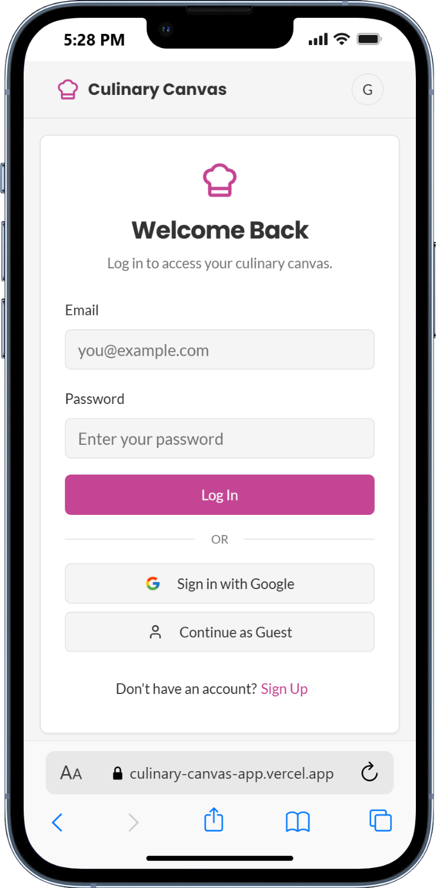
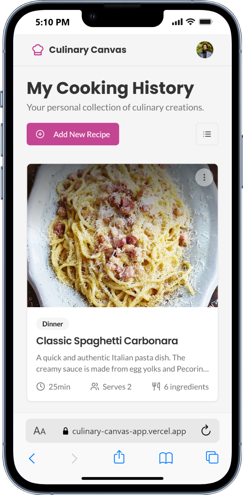
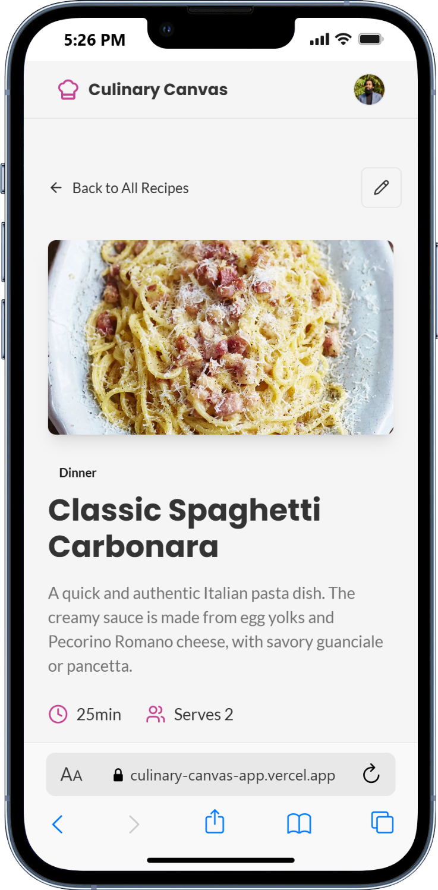
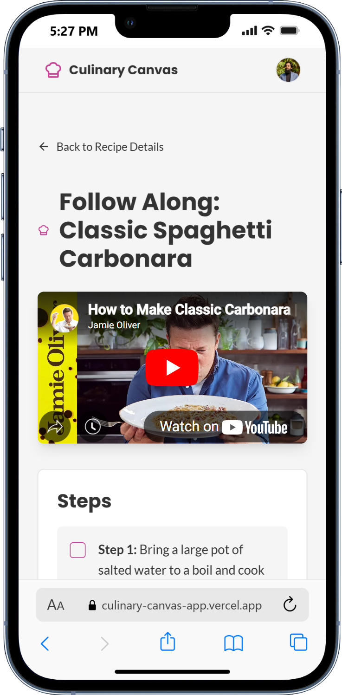

# Culinary Canvas 👨‍🍳
[**🔗culinary-canvas-app.vercel.app**](https://culinary-canvas-app.vercel.app/)


A modern, personal cookbook to save, organize, and follow along with your favorite recipes. Built with Next.js and Firebase.

---

## 📸 App Preview

<div align="center">

| Login & Sign-Up Page | Main Recipe Dashboard |
| :---: | :---: |
|  |  |
| **Recipe Detail View** | **"Follow Along" Mode** |
|  |  |\

</div>


---

## About The Project

"Culinary Canvas" is a web application designed for the modern home cook. It addresses the common problem of finding great recipes online (especially on video platforms) but having no elegant way to save, organize, and use them later.

This app provides a beautiful, card-based interface to create a visual library of your cooking journey. The standout feature is the **"Follow Along" mode**, which integrates a video player with an interactive step-by-step checklist, making it seamless to cook from your saved inspirations.

---

## ✨ Key Features

* **Create & Save Recipes:** Easily add new recipes with details like title, description, images, ingredients, steps, and a reference link.
* **Visual Dashboard:** Browse all your saved recipes in a clean, modern, and responsive card-based layout.
* **Follow Along Mode:** Cook with ease using an integrated video player alongside a checklist for your recipe steps.
* **Secure Authentication:** Robust user authentication system supporting multiple providers (Email/Password, Google).
* **Cloud Data Persistence:** Your recipe data is securely stored in the cloud with Firestore, accessible from any device.
* **Full Responsiveness:** A mobile-first design ensures a seamless experience on desktops, tablets, and smartphones.

---

## 🛠️ Tech Stack

This project is built with a modern, scalable tech stack:

* **Framework:** [Next.js](https://nextjs.org/) (React)
* **Styling:** [Tailwind CSS](https://tailwindcss.com/)
* **Backend & Database:** [Firebase](https://firebase.google.com/)
    * Firebase Authentication
    * Cloud Firestore
* **Deployment:** [Vercel](https://vercel.com/) / [Netlify](https://www.netlify.com/)

---

## 🚀 Getting Started

To get a local copy up and running, follow these simple steps.

### Prerequisites

* Node.js (v18 or later)
* npm or yarn

### Firebase Setup

1.  Go to the [Firebase Console](https://console.firebase.google.com/) and create a new project.
2.  Navigate to **Authentication** > **Sign-in method** and enable **Email/Password** and **Google** providers.
3.  Navigate to **Firestore Database** and create a new database. Start in `test mode` for initial setup.
4.  In your Project Settings, add a new **Web App** and copy the `firebaseConfig` object.

### Installation

1.  **Clone the repository:**
    ```sh
    git clone https://github.com/taher-dev/Culinary-Canvas.git
    ```
2.  **Navigate to the project directory:**
    ```sh
    cd Culinary-Canvas
    ```
3.  **Install NPM packages:**
    ```sh
    npm install
    ```
4.  **Create a local environment file:**
    Create a file named `.env.local` in the root of your project and add your Firebase configuration keys.

    ```env
    NEXT_PUBLIC_FIREBASE_API_KEY="your-api-key"
    NEXT_PUBLIC_FIREBASE_AUTH_DOMAIN="your-auth-domain"
    NEXT_PUBLIC_FIREBASE_PROJECT_ID="your-project-id"
    NEXT_PUBLIC_FIREBASE_STORAGE_BUCKET="your-storage-bucket"
    NEXT_PUBLIC_FIREBASE_MESSAGING_SENDER_ID="your-messaging-sender-id"
    NEXT_PUBLIC_FIREBASE_APP_ID="your-app-id"
    ```

5.  **Run the development server:**
    ```sh
    npm run dev
    ```
    Open [http://localhost:3000](http://localhost:3000) in your browser to see the result.
